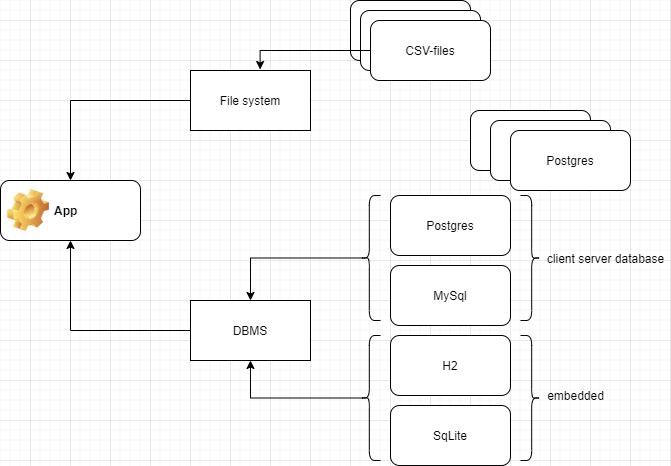
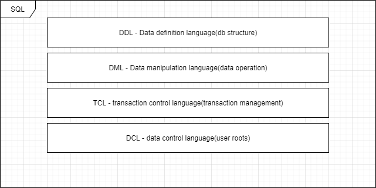
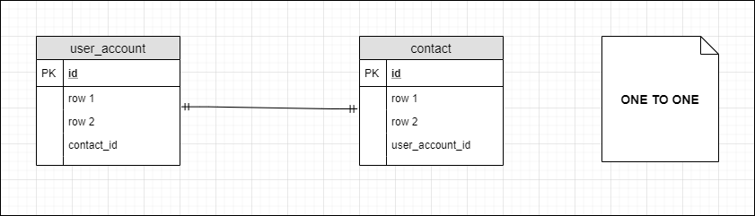
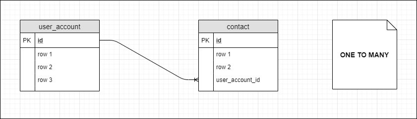
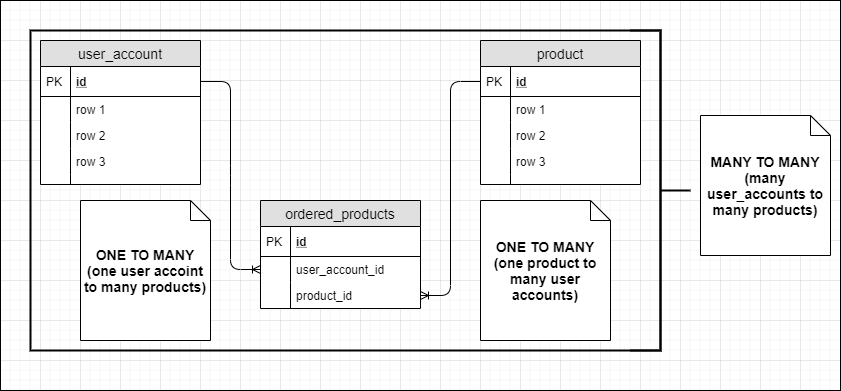
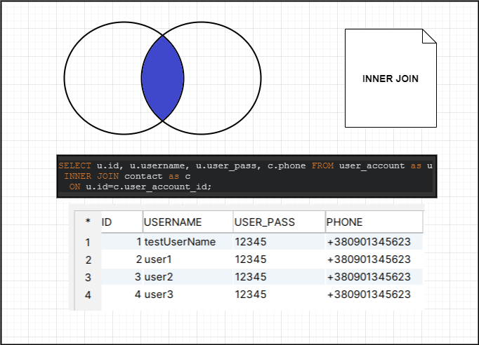
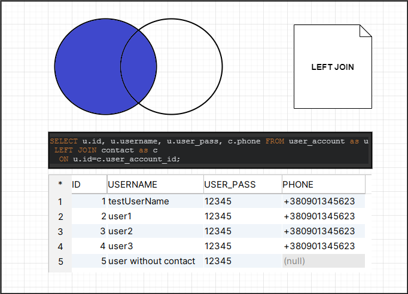
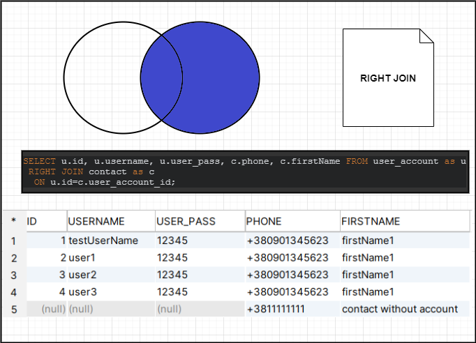

### Реляційні СУБД(Системи управління базами даних)

### Relational DBMS(Database management systems)

### SQLquery types

### DB Entity relationships:

ONE TO ONE

ONE TO MANY

MANY TO MANY

### JOINS:
INNER JOIN

LEFT JOIN

RIGHT JOIN

**Links:**

[h2database-datatypes](http://www.h2database.com/html/datatypes.html)
[DB-Visualizer](https://www.dbvis.com/download/)

